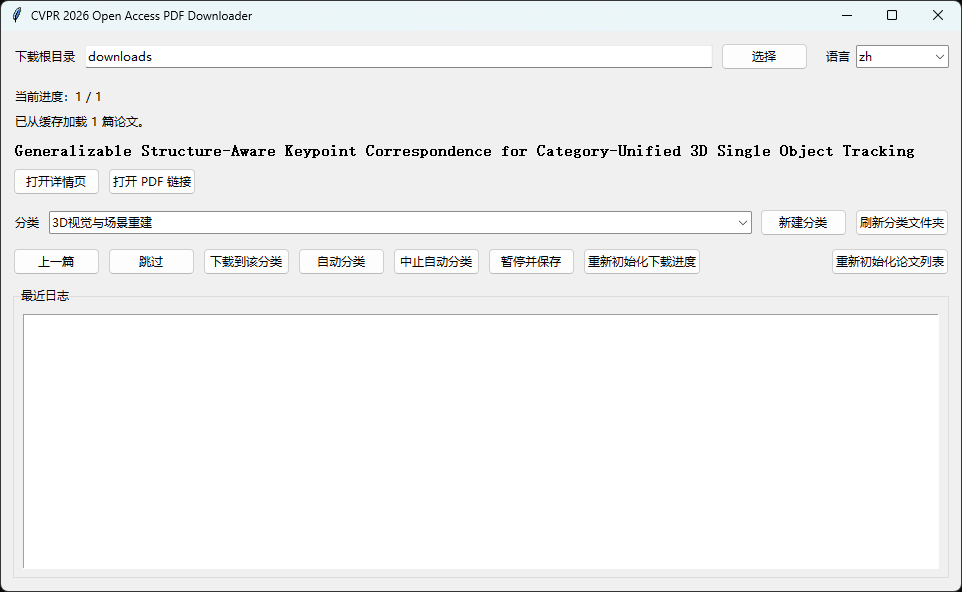

# Conference Paper PDF Downloader

A local desktop tool with a Tkinter GUI for browsing, classifying, and downloading conference papers. Parse paper metadata from configured paper sources, cache it locally, and save PDFs into custom category folders through user-controlled, rate-limited workflows.
> **Note:** Paper sources are configured in the `paper_sources` list in `config.json`.



## How It Works

1. On startup, load cached papers for the selected source, such as `data/papers.json` or `data/papers_icml2024.json`, if available.
2. If the cache is empty, crawl the selected paper source in a background thread and parse `title`, `detail_url`, and `pdf_url` for each paper.
3. Use the GUI to step through papers, assign categories, and download PDFs.
4. Optionally run **Auto Classify** to apply user-provided categories from `data/papers_with_categories.json` and download papers with the configured rate limits.
5. Progress and preferences persist in `data/state.json`.

Use **重新初始化论文列表** / **Reinitialize Paper List** when you need to rebuild `data/papers.json`. The crawler validates parsed PDF URLs and refuses to cache results when all PDF links collapse to the same URL.

Use **重新初始化下载进度** / **Reset Progress** to reset `data/state.json` download progress and records while keeping the current download root and language preference.

## Project Structure

```text
cvpr_downloader/
├── main.py                 # Entry point
├── config.json             # Crawler & download settings
├── requirements.txt
├── app/
│   ├── crawler.py          # Paper list discovery & parsing
│   ├── downloader.py       # PDF download logic
│   ├── gui.py              # Tkinter UI
│   ├── state.py            # Progress persistence
│   └── utils.py
├── data/
│   ├── papers.json         # Cached paper metadata
│   ├── papers_with_categories.json  # Labels for auto-classify
│   ├── state.json          # UI state & download records
│   └── logs.txt
└── downloads/              # Saved PDFs (by category)
    ├── 3D Vision and Scene Reconstruction/
    ├── Image and video generation/
    └── ...
```

## Prerequisites

- Python **3.9+**
- Network access to [openaccess.thecvf.com](https://openaccess.thecvf.com)

## Installation

### Windows

```powershell
python -m venv venv
.\venv\Scripts\activate
pip install -r requirements.txt
```

### macOS / Linux

```bash
python -m venv venv
source venv/bin/activate
pip install -r requirements.txt
```

## Quick Start

```bash
python main.py
```

On first launch with an empty cache, the app initializes the selected paper source in the background and writes results to the source-specific cache file. A status message appears when initialization completes; a dialog is shown after a fresh or manual reinitialization.

## Test Mode

For a quick smoke test, limit parsing in `config.json`:

```json
"paper_parse_limit": 10
```

This parses only the first 10 papers so you can inspect the source-specific cache file quickly.

For a full crawl, set:

```json
"paper_parse_limit": 0
```

Then click **Reinitialize Paper List** / **重新初始化论文列表** in the GUI to rebuild the cache.

## Configuration

Settings live in `config.json`:

```json
{
  "default_paper_source": "cvpr2026",
  "paper_sources": [
    {
      "id": "cvpr2026",
      "name": "CVPR 2026",
      "type": "cvf_openaccess",
      "conference_url": "https://openaccess.thecvf.com/CVPR2026",
      "fallback_all_papers_urls": [
        "https://openaccess.thecvf.com/CVPR2026?day=all"
      ]
    },
    {
      "id": "icml2025",
      "name": "ICML 2025",
      "type": "dblp_pmlr",
      "conference_url": "https://dblp.uni-trier.de/db/conf/icml/icml2025.html"
    },
    {
      "id": "iclr2025",
      "name": "ICLR 2025",
      "type": "dblp_openreview",
      "conference_url": "https://dblp.uni-trier.de/db/conf/iclr/iclr2025.html"
    }
  ],
  "paper_parse_limit": 0,
  "user_agent": "Mozilla/5.0 (Windows NT 10.0; Win64; x64) CVPR2026Downloader/1.0",
  "request_delay_seconds": [2, 6],
  "post_download_delay_seconds": [3, 8],
  "max_retries": 3
}
```

Notes:

- Each entry in `paper_sources` must define `id`, `name`, `type`, and `conference_url`.
- Supported source types are `cvf_openaccess`, `dblp_pmlr`, and `dblp_openreview`.
- For `cvf_openaccess`, `fallback_all_papers_urls` is used only when homepage discovery fails or yields no papers.

## Automatic Classification

The GUI provides:

- **Auto Classify** / **自动分类** — read `category` from `data/papers_with_categories.json` and download into matching folders
- **Stop Auto** / **中止自动分类** — request a stop; the app halts after the current PDF and its post-download delay finish

The bundled `data/papers_with_categories.json` was generated with ChatGPT for CVPR 2026 paper categorization. You may provide your own `data/papers_with_categories.json` for category-based organization.

`papers_with_categories.json` is a JSON array. Each entry needs `category` and at least one of `title` or `detail_url`:

```json
{
  "title": "Example Paper Title",
  "detail_url": "https://openaccess.thecvf.com/content/CVPR2026/html/example.html",
  "pdf_url": "https://openaccess.thecvf.com/content/CVPR2026/papers/example.pdf",
  "category_id": 3,
  "category": "3D Vision and Reconstruction"
}
```

## Disclaimer

This is an independent, unofficial tool for personal research organization. It is not affiliated with or endorsed by CVF, CVPR, IEEE, or any conference organizer.

The tool does not host, redistribute, modify, or remove watermarks from any papers. All copyrights remain with their respective authors or copyright holders. Users are responsible for complying with applicable website terms, copyright restrictions, and local requirements.

Please use conservative request rates and avoid concurrent or high-volume downloads. The maintainers are not responsible for misuse, access restrictions, service interruptions, downloaded content, or consequences arising from automated requests.

## Responsible Use

Before using the tool, review the CVF Open Access website and any applicable terms, policies, or access restrictions. By default, this tool is designed to process papers one at a time with user confirmation. Do not use it for aggressive crawling, concurrent downloads, mirroring, redistribution, or any activity that may place excessive load on the CVF Open Access website.

## License

This project is licensed under the MIT License. See [LICENSE](LICENSE) for details.
